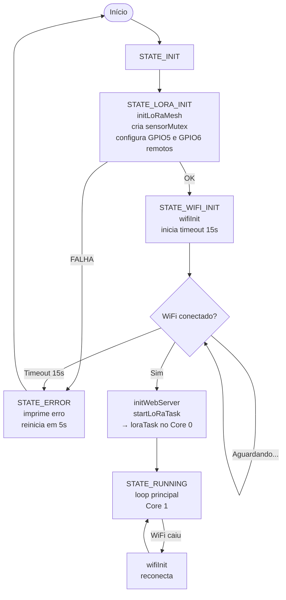
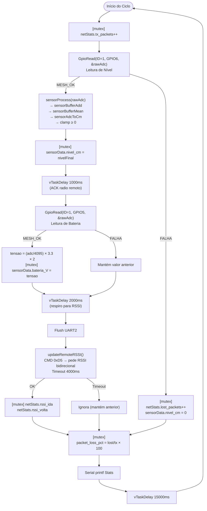
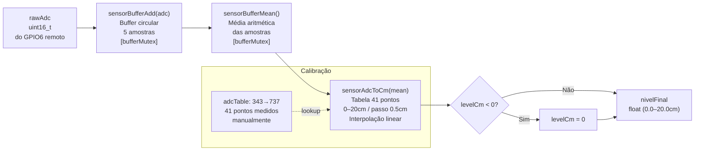
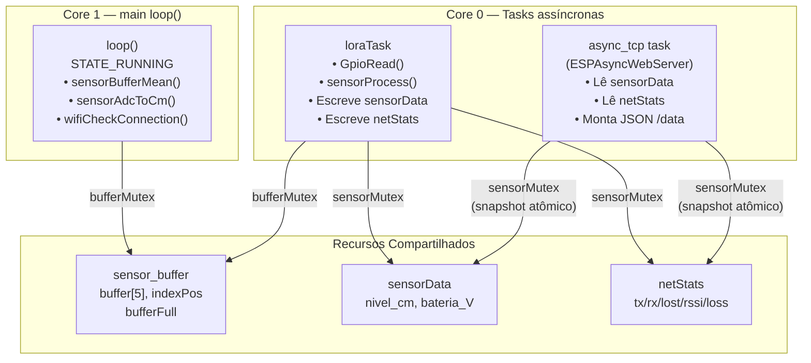
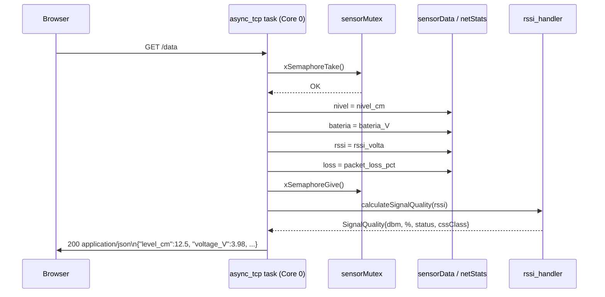

# Documentação — SensorDeNivel_V0

Firmware ESP32 para monitoramento remoto de nível d'água em curvas de nível em lavouras de arroz via LoRaMESH com dashboard web.

---

## Árvore do Projeto

```
SensorDeNivel_V0/
│
├── platformio.ini                  # Configuração do projeto PlatformIO
├── sensor-de-nivel.code-workspace  # Workspace do VSCode
├── README.md                       # README padrão PlatformIO
├── DOCUMENTACAO.md                 # Esta documentação
├── .gitignore
│
├── .vscode/
│   ├── c_cpp_properties.json       # IntelliSense (gerado pelo PlatformIO)
│   ├── extensions.json
│   └── launch.json
│
├── data/
│   └── index.html                  # Frontend web (enviado para SPIFFS)
│
├── include/                        # Headers públicos
│   ├── README                      # README padrão PlatformIO
│   ├── data_model.h                # Structs SensorData, NetworkStats + sensorMutex
│   ├── lora_mesh.h                 # initLoRaMesh(), startLoRaTask(), xLoraTaskHandle
│   ├── rssi_handler.h              # Struct SignalQuality + calculateSignalQuality()
│   ├── sensor_buffer.h             # sensorBufferInit/Add/Mean
│   ├── sensor_calibration.h        # sensorAdcToCm()
│   ├── sensor_processing.h         # sensorProcessingInit(), sensorProcess()
│   ├── web_server.h                # initWebServer()
│   └── wifi_manager.h              # wifiInit(), wifiCheckConnection(), wifiGetIP()
│
├── lib/
│   ├── README                      # README padrão PlatformIO
│   └── LoRaMESH/
│       └── src/
│           ├── LoRaMESH.h
│           └── LoRaMESH.cpp        # Biblioteca local Radioenge (protocolo proprietário)
│
└── src/                            # Implementações
    ├── main.cpp                    # State machine principal (setup + loop)
    │
    ├── data_model/
    │   └── data_model.cpp          # Definição de sensorData, netStats, sensorMutex
    │
    ├── lora_mesh/
    │   └── lora_mesh.cpp           # loraTask(), initLoRaMesh(), startLoRaTask()
    │
    ├── rssi_handler/
    │   └── rssi_handler.cpp        # Tradução dBm → porcentagem + classe CSS
    │
    ├── sensor_processing/
    │   ├── sensor_buffer.cpp       # Buffer circular 5 amostras (thread-safe c/ mutex)
    │   ├── sensor_calibration.cpp  # Tabela de calibração ADC→cm + interpolação linear
    │   └── sensor_processing.cpp   # Pipeline: add → mean → convert
    │
    ├── web_server/
    │   └── web_server.cpp          # ESPAsyncWebServer: GET /, GET /data, POST /upload
    │
    └── wifi_manager/
        └── wifi_manager.cpp        # WiFi modo STA + auto-reconexão
```

---

## Arquitetura de Hardware

```
┌─────────────────────────────────────────────────────────────────┐
│                        NÓ DO SENSOR (Remoto)                    │
│                                                                 │
│   Curva de nível/lavoura Arroz   Bateria                        │
│        │                          │                             │
│   ┌────▼─────────────┐        ┌────▼──────────┐                 │
│   │ Sensor Capacitivo│        │ Div. Resistivo │                │
│    + vondicionamento │        │  100k / 100k   │                │
│   └────────┬─────────┘        └──────┬────────┘                 │
│            │ ADC                    │ ADC                       │
│        ┌───▼────────────────────────▼──┐                        │
│        │      Módulo LoRaMESH          │                        │
│        │   GPIO6 = Nível (ADC)         │                        │
│        │   GPIO5 = Bateria (ADC)       │                        │
│        └───────────────┬───────────────┘                        │
└────────────────────────│────────────────────────────────────────┘
                         │ LoRa 915 MHz (Mesh)
┌────────────────────────│────────────────────────────────────────┐
│                  GATEWAY (ESP32 DevKit)                         │
│                         │                                       │
│        ┌────────────────▼───────────────┐                       │
│        │      Módulo LoRaMESH (Local)   │                       │
│        │        UART2: GPIO16/17        │                       │
│        │        9600 baud               │                       │
│        └────────────────┬───────────────┘                       │
│                         │ HardwareSerial                        │
│        ┌────────────────▼───────────────┐                       │
│        │           ESP32                │                       │
│        │  Core 0: loraTask + async_tcp  │                       │
│        │  Core 1: main loop (WiFi)      │                       │
│        └────────────────┬───────────────┘                       │
│                         │ WiFi 2.4 GHz                          │
└──────────────────────────────────────────────────────────────── ┘
                          │
                    ┌─────▼──────┐
                    │  Browser   │
                    │  Porta 80  │
                    │ Dashboard  │
                    └────────────┘
```

---

## Fluxograma 1 — Boot e State Machine



---

## Fluxograma 2 — loraTask (Core 0, ciclo 15s)



---

## Fluxograma 3 — Pipeline de Processamento do Sensor



---

## Fluxograma 4 — Concorrência FreeRTOS



---

## Fluxograma 5 — Requisição Web GET /data



---

## Módulos e Responsabilidades

| Módulo | Arquivo | Responsabilidade |
|---|---|---|
| **main** | `src/main.cpp` | State machine de boot; watchdog WiFi no loop |
| **lora_mesh** | `src/lora_mesh/lora_mesh.cpp` | Ciclo LoRa: leitura GPIO remoto, RSSI, escrita nos dados globais |
| **data_model** | `src/data_model/data_model.cpp` | Dados globais `sensorData`, `netStats`, `sensorMutex` |
| **sensor_buffer** | `src/sensor_processing/sensor_buffer.cpp` | Buffer circular 5 amostras (thread-safe) |
| **sensor_calibration** | `src/sensor_processing/sensor_calibration.cpp` | Tabela ADC→cm (41 pts) + interpolação linear |
| **sensor_processing** | `src/sensor_processing/sensor_processing.cpp` | Pipeline: buffer → média → calibração → clamp |
| **rssi_handler** | `src/rssi_handler/rssi_handler.cpp` | Traduz dBm em porcentagem e classe CSS |
| **web_server** | `src/web_server/web_server.cpp` | Serve `index.html` (SPIFFS), API `/data` (JSON), upload OTA de HTML |
| **wifi_manager** | `src/wifi_manager/wifi_manager.cpp` | Conexão WiFi STA, verificação de status, IP |
| **LoRaMESH** | `lib/LoRaMESH/src/` | Biblioteca Radioenge: framing, envio/recepção, GPIO remoto |

---

## Dados Globais Compartilhados

### `SensorData` (protegido por `sensorMutex`)
| Campo | Tipo | Descrição |
|---|---|---|
| `nivel_cm` | `volatile float` | Nível do tanque em cm (0.0–20.0, resolução 0.5cm) |
| `bateria_V` | `volatile float` | Tensão da bateria em V (após divisor 100k/100k) |

### `NetworkStats` (protegido por `sensorMutex`)
| Campo | Tipo | Descrição |
|---|---|---|
| `tx_packets` | `volatile uint32_t` | Total de ciclos de leitura tentados |
| `rx_packets` | `volatile uint32_t` | Total de leituras de nível bem-sucedidas |
| `lost_packets` | `volatile uint32_t` | Total de falhas na leitura de nível |
| `packet_loss_pct` | `volatile float` | Percentual de perda (lost/tx × 100) |
| `rssi_volta` | `volatile int` | RSSI do sensor → gateway em dBm (mais relevante) |
| `rssi_ida` | `volatile int` | RSSI do gateway → sensor em dBm |

---

## Tabela de Calibração

| Índice | ADC | Nível (cm) |
|---|---|---|
| 0 | 343 | 0.0 |
| 1 | 353 | 0.5 |
| ... | ... | ... |
| 20 | 609 | 10.0 |
| ... | ... | ... |
| 40 | 737 | 20.0 |

- **Fonte:** medições manuais do circuito capacitivo
- **Método:** interpolação linear entre pontos adjacentes
- **Out-of-range:** clamp — ADC < 343 retorna 0.0 cm, ADC > 737 retorna 20.0 cm

---

## Configuração PlatformIO

| Parâmetro | Valor |
|---|---|
| Board | `esp32dev` |
| Framework | `arduino` |
| Monitor speed | 115200 baud |
| Monitor filter | `esp32_exception_decoder` |
| Lib: WebServer | `ESPAsyncWebServer` (lacamera fork) |
| Lib: TCP | `AsyncTCP` (dvarrel fork) |
| Lib: JSON | `Arduino_JSON` |
| Lib: LoRa | local `lib/LoRaMESH/` |

---

## API REST

### `GET /`
Serve `index.html` do SPIFFS. Se vazio, exibe página de upload.

### `GET /data`
Retorna JSON com snapshot atômico dos dados (protegido por `sensorMutex`):
```json
{
  "level_cm": 12.5,
  "voltage_V": 3.98,
  "rssi_dbm": -87,
  "signal_pct": 47,
  "signal_qual": "Regular",
  "signal_class": "signal-fair",
  "loss_pct": "2.50",
  "radio_model": "Radioenge LoRaMESH"
}
```

### `POST /upload`
Upload de `index.html` via multipart form. Suspende `loraTask` durante o upload para liberar SPIFFS.

---

## Classificação de Sinal RSSI

| dBm | Status | CSS Class |
|---|---|---|
| ≥ -65 | Excelente | `signal-excellent` |
| -85 a -65 | Bom | `signal-good` |
| -100 a -85 | Regular | `signal-fair` |
| -115 a -100 | Fraco | `signal-weak` |
| < -115 | Crítico | `signal-dead` |
| ≥ 0 | Sem Sinal | `signal-dead` |
SS